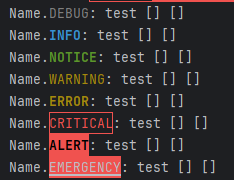

# logdye
Colored Line Formatter for Monolog
## Features
- monolog v3+
- lightweight
- 100% test coverage
- phpstan max lvl
- phpstan full strict rules

## Install
```shell
composer requier olegv/logdye
```

```php
<?php
use Monolog\Handler\StreamHandler;
use Monolog\Level;
use Monolog\Logger;
use OlegV\Logdye;
```
## Usage
```php
//logger
$logger = new Logger('Name');

$formatter = new Logdye(
    "[%datetime%] %channel%.%level_name%: %message% %context% %extra%\n",
    "Y-m-d H:i:s"
);

$handler = new StreamHandler("php://stdout", Level::Debug);
$handler->setFormatter($formatter);
$logger->pushHandler($handler);

$logger->Debug('');
$logger->Debug('test');
$logger->Info('test');
$logger->Notice('test');
$logger->Warning('test');
$logger->Error('test');
$logger->Critical('test');
$logger->Alert('test');
$logger->Emergency('test');
```
You will see:

